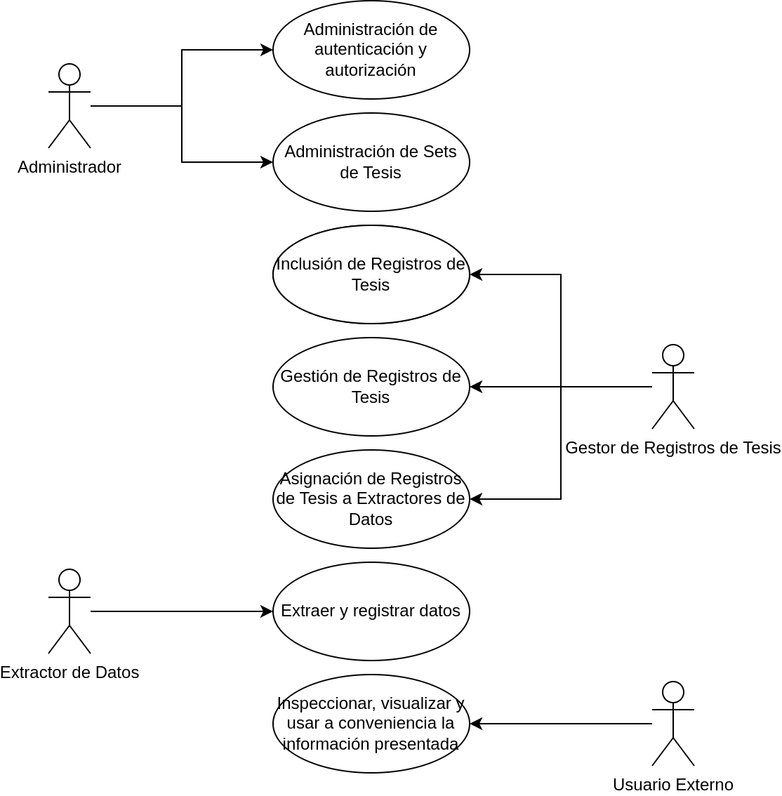

# Software Impact Measurement System

## Showcase

This system aims to enable the analysis of the software products developed by bachelor graduates at Universidad Técnica del Norte, as part of their thesis projects. It achieves so by providing modules to fulfill the following use cases:



With basis on the presented use cases, this system is architected with the following modular structure:


and components:


Having explained the use cases, modules and components, a detail of each module is provided.

### Authentication and Authorization (Autenticación y autorización)

This module allows to the management of users, groups and permissions, via a series of user interfaces and strong bussiness logic to handle users, groups and permissions enablement and disablement, among other tasks.  
The ussage of this module is on first instance only permited to the root user (user that initializes the system), but this can be heavily modified thanks to the capabilities of the system, that allows for the creation of permissions that can be assigned to many groups, and this groups themselves can have many users.

#### Database schema


#### User interfaces

##### Permissions manager

Create, update, enable and disable permissions with name and route.


##### Groups manager

Create, update, enable, disable groups, and add or remove permissions from them.


##### Users manager

Create, update, enable, disable users, and add or remove them to groups.


### Harvesting (Adquisición de datos)

This module allows to the addition of thesis records from the external source (UTN's bibliographic repository), the assignment of thessis records to users (so they can harvest data according to specific study variables), the registering of the harvested data, and the parametrization of study variables in relation to the questions and answers handled by the third-party software Limesurvey.

#### Database schema


#### User interfaces

##### Thesis sets manager

Create thesis sets. The thesis set belong to the identificator of certain set available in an external bibliographic repository that implements the standard OAI-PMH v2.


##### Study variables manager

Create study variables with specific parameters.


##### Limesurvey question linking

A series of screens that enable the user to link study variables to its counterparts: surveys, questions and answers, that have been previously registered at the third-party software limesurvey.

1. Question registration on limesurvey
   - Stopping the survey if started:
     
   - Declaring the question and its specifics
     
   - Reactivating and restoring participants table:
     
2. Question linking
   - 
   - 
   - 
   - 

##### Thesis records inclusion

A series of screens that enable the user to include thesis records from external sets that comply with the standard OAI-PMH v2. Only new records will appear.

- 
- 
- 
- 

##### Thesis records manager

Read and export of thesis records previously included.


##### Thesis records assignment

Assign thesis records and surveys of the third party system to users, so they can answer to specific questions and harvest data for the study variables. The interface will show an up to date list of the surveys available at the external system.

- 
- 
- 
- 

##### Data harvesting

An interface provided to the user that is meant to analyse each thesis record assigned to him and register data for the different questions. The interface provides the details of the thesis record that has been assigned, links that redirect to the assigned surveys available at the external system and a confirmation button to retrieve the answers to the database.

- 

The survey shown to the user in the external system looks like this:

- 

### Analytics

This module is meant to provide useful information in the form of descriptive statistical graphics, with basis in the data harvested by the users using the tools provided by the Harvesting module. It also exposes the harvested data in a processed way via REST APIs, so other researchers can benefit from them.

#### Database schema

The database schema is composed only by views and not tables themselves.


#### User interfaces

##### Analytics dashboard

A panel with a series of useful statistical graphics that describe the harvested data.


##### REST API Map

An informative view that describes and exemplifies the available endpoints. They include all the needed data to perform analysis over the harvested data.


An example of the processed data is provided


##### Tableau WDC

An informative view that describe the availabe tableau web data conectors, useful to built complex graphics using Tableu. It is important to note that the available WDCs were the ones used to build the different statistical graphics, that were later embed into the interface.


## How to run

Having **Maven**, **Java** and **Docker** installed locally.

### Development environment

1. Clone the repository.
2. Run:
   ```bash
   docker compose -f docker-compose.yml -f docker-compose.dev.yml up -d
   ```
3. Execute the sql script `db-schema.sql` available at `db/` on the database, you can use tools such as dbeaver.
4. Package and deploy the aplication running:
   ```bash
   mvn clean package && docker cp ./swimsEAP/target/swims-1.0.ear swims-wildfly-dev:/app
   ```
   or compiling within a docker container
   ```bash
   docker run -it --rm --name swims_mvn_dev -v "$(pwd)":/usr/src/mymaven -v ~/.m2:/root/.m2 -w /usr/src/mymaven maven:3-openjdk-11 mvn clean install && docker cp ./swimsEAP/target/swims-1.0.ear swims-wildfly-dev:/app
   ```
5. Seed the system under `/seed`, the registered user will become the `root` user, it will have special privileges within the Auth module.

## Command cheatsheet

1. Deploy application to docker container

   ```bash
   mvn clean package && docker cp ./swimsEAP/target/swims-1.0.ear swims-wildfly-dev:/app
   ```

2. Deploy postgresql-42.5.0.jar to wildfly-dev docker container

   ```bash
   docker cp ./docker/prod/wildfly/postgresql-42.5.0.jar swims-wildfly-dev:/app
   ```
